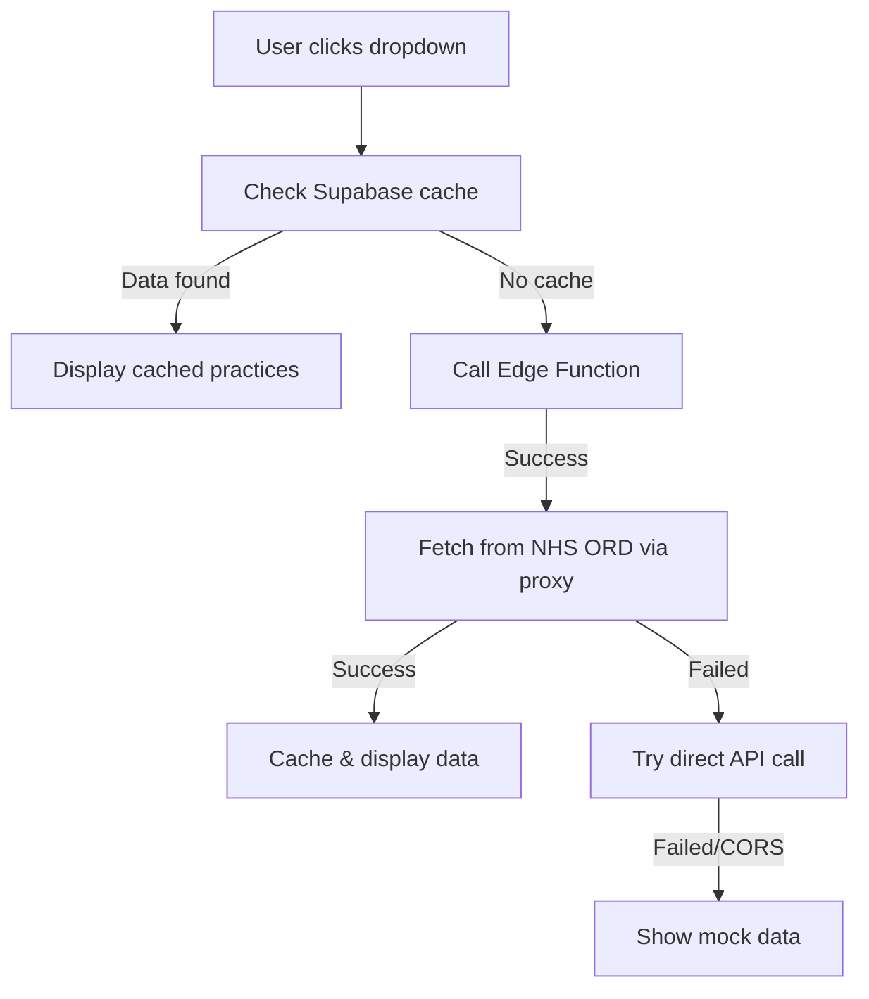

# Supabase GP Practices Proxy Setup

This guide explains how to set up Supabase to act as a proxy for NHS ORD API requests, avoiding CORS issues.

## Overview

The solution consists of:
1. A database table to cache GP practice data
2. An Edge Function to proxy NHS ORD API requests
3. Client-side code that automatically tries Supabase first

## Setup Instructions

### 1. Create the Database Table

Run the SQL script in your Supabase SQL editor:

```sql
-- Execute the contents of supabase-gp-practices-setup.sql
```

This creates:
- `gp_practices_cache` table to store GP practice data
- Proper indexes for performance
- Sample data for testing

### 2. Deploy the Edge Function

```bash
# Install Supabase CLI if not already installed
npm install -g supabase

# Login to Supabase
supabase login

# Link to your project
supabase link --project-ref unveoqnlqnobufhublyw

# Deploy the Edge Function
supabase functions deploy fetch-gp-practices

# Test the function locally (optional)
supabase functions serve fetch-gp-practices --no-verify-jwt
```

### 3. Configure CORS (if needed)

In your Supabase dashboard:
1. Go to Functions
2. Select `fetch-gp-practices`
3. Ensure CORS is enabled for your domain

### 4. Test the Integration

The dropdown will now automatically:
1. Try Supabase cache first (fastest)
2. Try Supabase Edge Function proxy (avoids CORS)
3. Fall back to direct NHS ORD API (may hit CORS)
4. Use mock data if all else fails

## How It Works



## Benefits

1. **No CORS issues** - Edge Function acts as proxy
2. **Better performance** - Data is cached in Supabase
3. **Fallback options** - Multiple layers of redundancy
4. **Secure** - Service key never exposed to client

## Monitoring

Check Edge Function logs:
```bash
supabase functions logs fetch-gp-practices
```

## Updating Cache

The cache automatically updates when:
- No cached data exists
- Edge Function successfully fetches new data

To force a refresh, clear the `gp_practices_cache` table:
```sql
TRUNCATE TABLE gp_practices_cache;
```

## Security Notes

⚠️ **NEVER** put the service key in client-side code
✅ Edge Functions use service role key securely
✅ Database has proper RLS policies
✅ Public can only read, not write